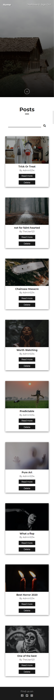
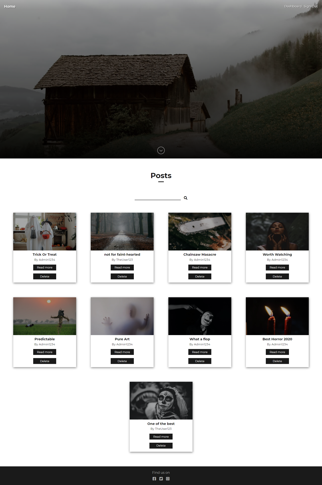
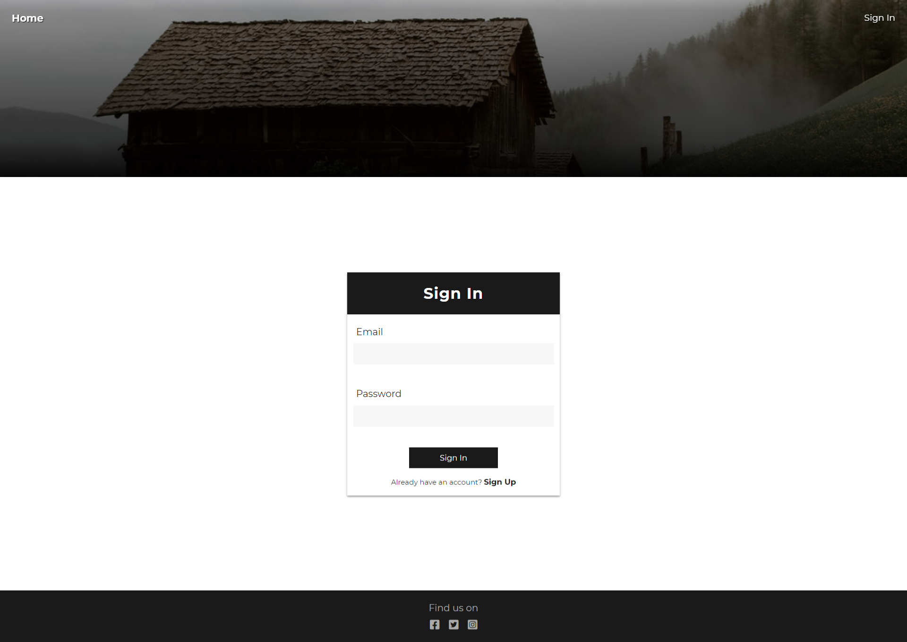
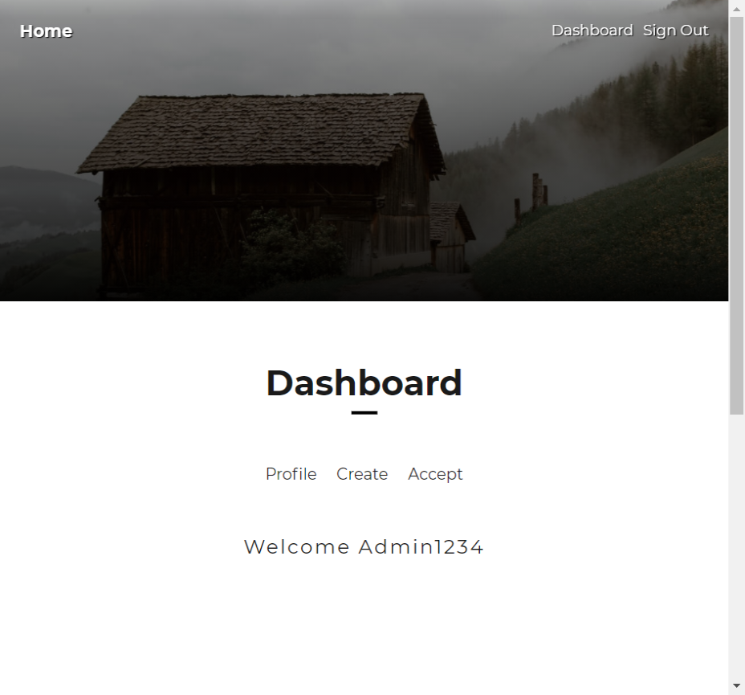
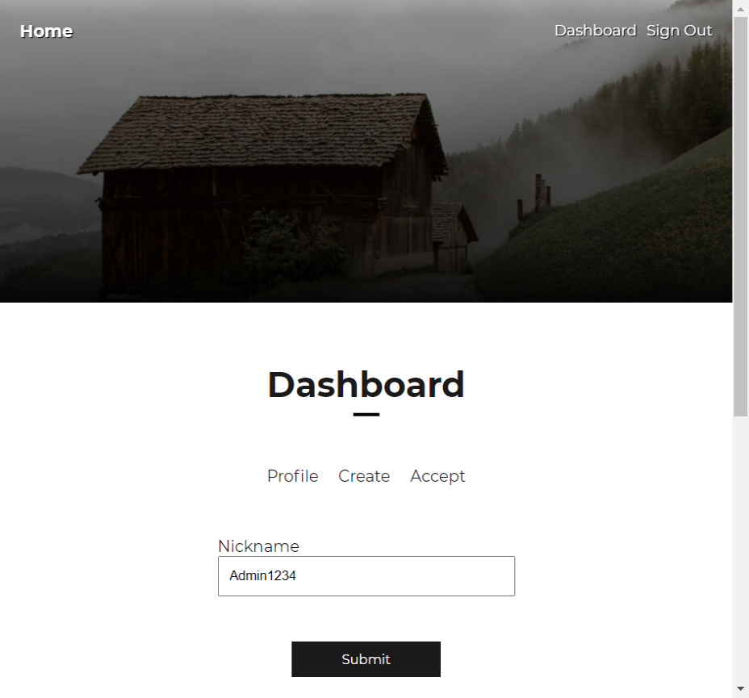
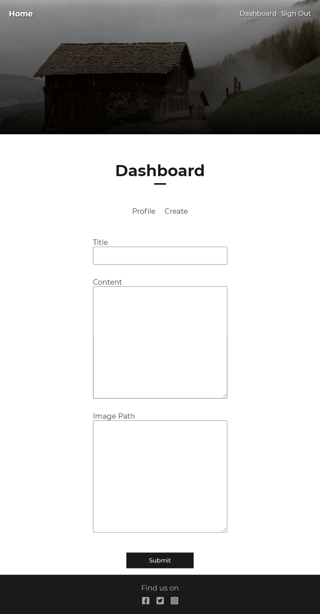
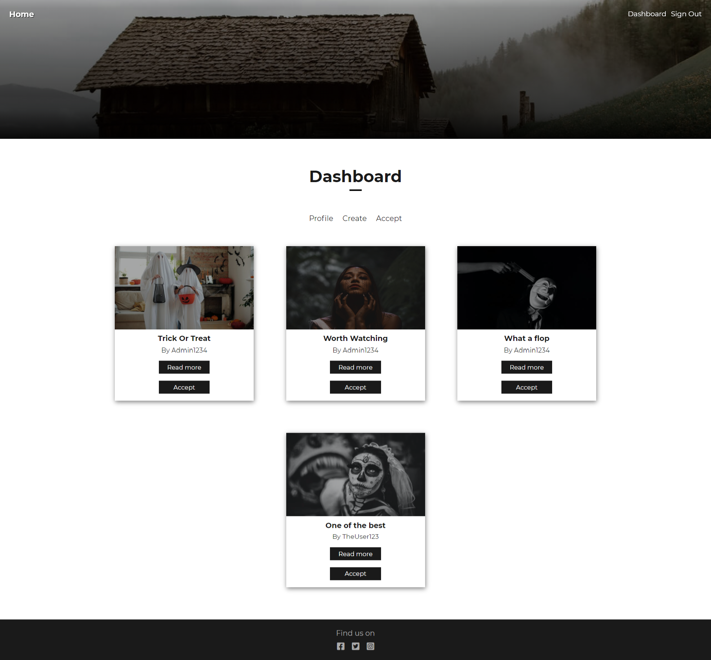
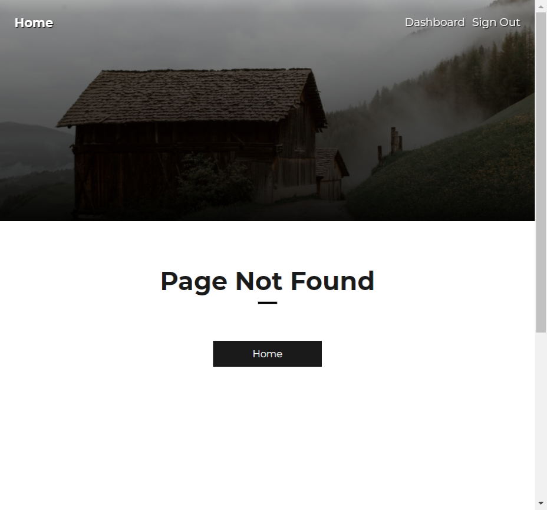
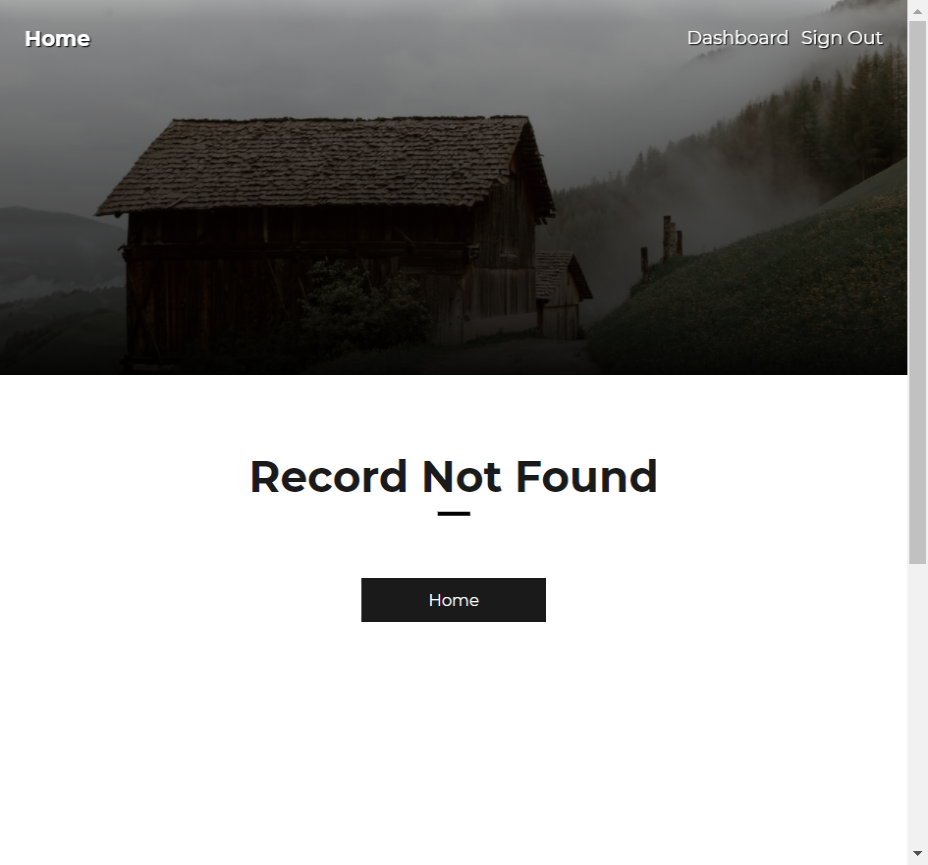
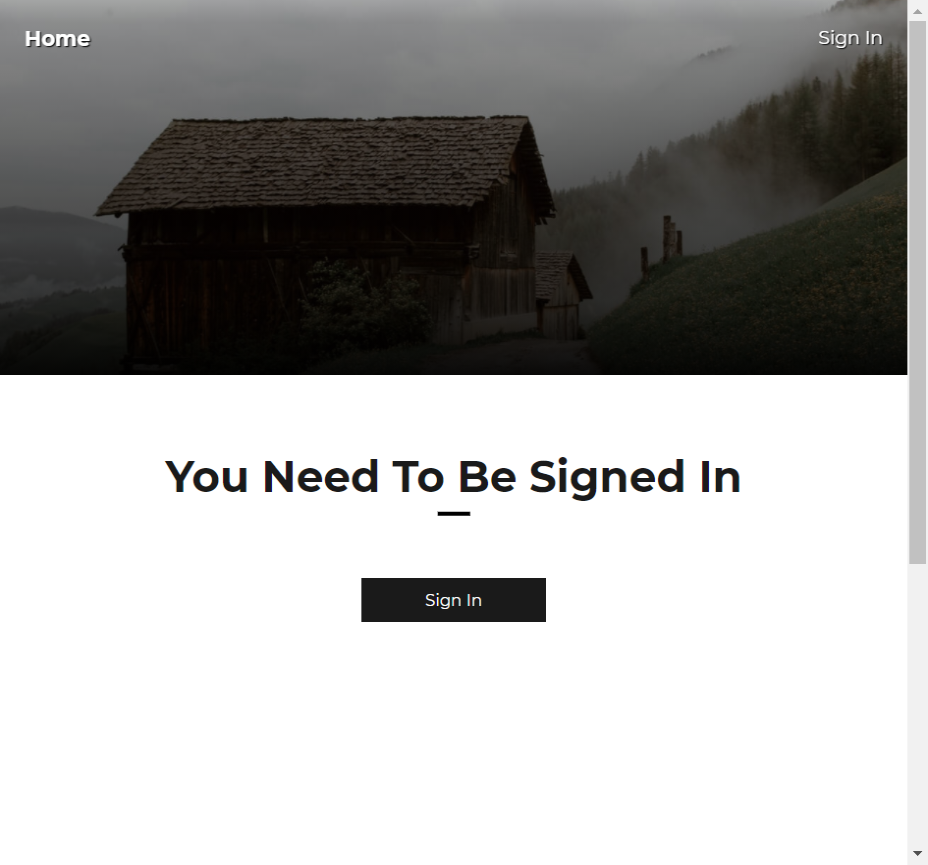

# Movies Blog

## Views:

### Home:

### Sign form

### Dashboard:

### Errors:

## Functionality:
### Navbar (two link types):

-for signed in users:

a)Home - carries user to '/home'

b)Dashboard - carries user to '/dashboard' 

c)Sign Out - signs out user and carries him to '/sign'

-for signed out users:

a)Home - carries user to '/home'

b)Sign In - carries user to '/sign'

### Sign Form:

-user can toogle between Signing In and Signing Out by clicking at bold 'sign in' or 'sign out' area

-after succesful signing user will be carries to '/'

-sign up validation:

a) user can't create multiple accounts with one email adress

b) password between 8-15 characters

c) password must contain at least one digit

d) password must contain at leat one capital letter

e) password shall not contain white spaces

-sign in validation:

a) user not found in database

b) user acc was disabled by admin

c) wrong password

### Home:

-arrow button in hero section carries user to posts

-user can search through post by using search form

-user can see more details about post by clicking 'Read More' button

-user can delete post by clicking 'Delete' button (only for admins)

### Details (only for signed in users): 

-user can read post content

### Dashboard (only for sign in users)

-user can edit his profile name in 'profile' section

-user can add post in 'create' section (post has to be accepted by admin)

-user can accept post in 'accept' section (only for admins)

### Error types:

-authorization required (when signed out user tries to visit '/create','my-list','/details/:id')

-already signed in (when user tries to visit /sign-in, /sign-up while being signed in)

-request not found (when user tries to visit /details/:id with wrong id)

-page not found (when user tries to visit incorrect path)

